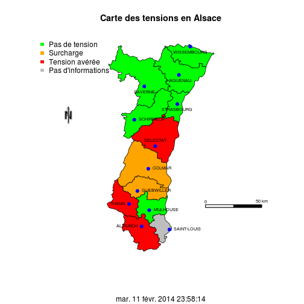

Hôpital en tension (HET)
========================================================
author: RESURAL
date: 2 décembre 2014
autosize: true

Carte des tensions
========================================================

Définition
========================================================

L'HET est une situation exceptionnelle conséquence d'une inadéquation entre 
- les moyens disponibles (lits, personnel) 
- et les besoins immédiats d'hospitalisation non programmée. 

C'est une situation critique pouvant évoluer ver une situation de crise. 

Cette définition est proche de celle d'une situation de catastrophe (déséquilibre entre l'offre et la demande).

Trois grandes classes de tensions
========================================================

1. Tensions d'__affluence__
    - épidémique (grippe, bronchiolite)
    - saisonnière (marché de Noël) ou hebdomadaire (lundi)
    
2. Tensions par __défaut d'effectifs soignants__ aux urgences
    - structurel (congés, mouvement social, effectifs insuffisants,...)
    - charge en soins (plusieurs patients en SAUV)
    
3. Tension par __carence en lit d'aval__
    - en hospitalisation conventionnelle
    - en soins critiques (Réa, SI, SC)
    - en psychiatrie (chambres d'isolement
    - en pédiatrie
    - en maternité

Détection des situations de tension
===================================

Les signalements par les professionnels des services de soins
----------------

__Seul le chef d'établissement peut déclencher le plan "hôpital en tension" (PHT)__.

- On appelle __"alerte tension"__ ou "pré-tension" des situations de grandes difficultés générant des alertes "sauvages" vers l'ARS ou le SAMU

- Il est indispensable d'encadrer ces pratiques au niveau régional en assurant une rétro-information fiable entre direction des établissements, ARS et SAMU.

=========================================

- RESURAL propose de créer  un __outil en ligne__ qui informe systématiquement 
    - la direction de l'établissement
    - la plateforme de veille de l'ARS
    - les SAMU
    - les partenaires "utiles" (SDIS, Associations de PDS...)

La __traçabilité de ces alertes__ et déclaration de tension représente une mine d'informations nécessaires pour conduire l'évaluation de l'action d'une région. 

La centralisation et la formalisation des signalements constitue la première brique de __l'évaluation de l'action HET__ d'un établissement ou d'une région.

Exemple de formulaire
========================================

- Etablissement: liste déroulante
- Déclarant: identification
- Email déclarant:
- Téléphone d'astreinte du déclarant
- déclaré le: date/heure
- motif de l'alerte: texte libre (pas de lits disponible en médecine et en chirurgie. Accumulation de patients non hospitalisés pour manque de lits.)

Autorisation: médecin senior uniquement.

---

Formulaire simplifié
====================

Signalement par les directions d'établissement
==============================================

Le signalement "alerte tension" ou "pre-tension" par le DG n'est pas un déclenchement officiel du PHET, mais un signal de réaction précoce qui suppose que la __cellule de veille__ ou un professionnel de l'établissement aient déjà signalé une difficulté.

L'engagement du directeur est déjà une action qui le conduit:
- à anticiper
- à mettre en place les premières mesures
- à tracer la démarche

Signalement des situations épidémiques
======================================

- Mission spécifique de l'InVS qui vaut signal d'alerte.

- La connaissance de ces situations par la cellule de veille HET est un pré-requis indispensable.

- RESURAL souhaite mettre en place un système de relais de ces informations couplée avec des indicateurs d'HET.

Quels indicateurs ?
===================
type: sub-section

La FEDORU à identifié 39 indicateurs
========================================
incremental: true

que l'on peut répartir en cinq catégories [nombre d'indicateurs]:

- indicateurs __AMONT__ (SAMU) [6]
- indicateurs activité des __URGENCES__ [12]
- indicateurs __HOSPITALISATION A PARTIR DES URGENCES__ [8]
- indicateurs __DISPONIBILITÉ__ DES LITS D'AVAL__ [10]
- indicateurs __AVAL DES SERVICES DE COURT SÉJOUR__ [3]

Pour chaque indicateurs ont été défini:
======================================
incremental: true

- la __fréquence__ de recueil idéale
- les indicateurs __proches__
- la nécessité ou non d'une __antériorité__ (recueil sur du long terme)
- si une __automatisation__ du recueil est possible
- la __complexité__ du recueil
- si l'indicateur s'applique à la __détection ou au suivi__ de la tension
- le __type de tension__ pour lequel il est le plus adapté

1. Indicateur d'Amont
===================================

1.1 nombre de Dossier de régulation médicale (DRM) par 24h

1.2 nombre de DRM ouverts à un instant donné  

1.3 nombre de DRM avec orientation vers un service d'urgence à un instant donné  

1.4 nombre de SMUR engagés à un instant donné  

1.5 nombre de VSAV régulés à un instant donné  

1.6 alerte InVS - épidémie

2. Urgences
===================================

2.1 nombre de patient par médecin des urgences à un instant donné

2.2 nombre de passages sur les 24 dernières heures (RPU)

2.3 nombre de patients présents (TOP, RPU)

2.4 nombre de patients présents depuis plus de 6 heures

2.5 nombre de patients en attente de lits à un temps donné

2.6 nombre de patient en attente de prise en charge

2. Urgences (suite)
===================================

2.7 nombre de patients en UHCD

2.8 nombre de patients en attente de biologie ou d'imagerie

2.9 nombre de patients selon le code de gravité identifié au Tri IOA

2.10 Durée moyenne de présence aux urgences (RPU)

2.11 nombre de patients pris en charge par un médecin à un instant donné

2.12 NEDOCS

3. Hospitalisation à partir des urgences
===================================

3.1 Nombre de patients en attente de prise en charge dans un lit d'hospitalisation à un instant donné

3.2 Nombre de lits libérables.

3.3 Délai écoulé depuis la dernière admission en service de court séjour.

3.4 Temps d'attente moyen entre la décision d'admission et l'admission dans un service d'aval

3.5 Nombre de patients en attente d'un lit à un instant donné

3.6 Nombre de transfert par défaut de lit depuis 24 heures dont HAD

3.7 Nombre d'hospitalisations à partir des urgences

3.8 Nombre d'hospitalisations à partir des urgences à par unité d'aval.

4. Disponibilité des lits d'aval
===================================

4.1 Nombre de lits disponibles par service

4.2 Nombre d'admissions avant 12 heures

4.3 Nombre d'admission à horaire tardif

4.4 Nombre d'admissions programmées avec DMS cible

4.5 Nombre de journées non pertinentes (plus de 10j, plus de 30j)

4.6 Nombre de patients déprogrammés

4.7 DMS par service

4.8 Nombre de médecins présents pour chaque unité un jour donné

4.9 pourcentages de lits d'aval fermés dans l'établissement par rapport au au nombnre de lits d'aval de l'établissement

4.10 Nombre d'admissions programmées selon le jour de la semaine

5. Aval des services de court séjour
===================================

5.1 Nombre de demandes de places en SSR en cours

5.2 Nombre de patients hospitalisés en attente de place en EHPAD

5.3 Nombre de patients en soins critiques en attente de place en MCO ou autre un instant donné.

Suivi des indicateurs
=====================
type: sub-section

Organiser la veille
-------------------

Au niveau des établissements
============================

- La __cellule de veille__ est une émanation de la commission des admissions et des soins non programmés. 

- La fiche n°36 de la __circulaire relative à l'élaboration des plans blancs__ en détaille la composition (DG, direction des soins, SU). 

- En période de tension elle analyse un __tableau de bord__ (à définir) quotidiennement. 

-L'existence de cette cellule et sa réalité opérationnelle constituent en soi un __indicateur__ mesurant l'implication de la structure dans le gestion des tensions. 

- Idéalement la cellule rédige quotidiennement un __bilan de situation__ qui est transmis au serveur régional de veille et d'alerte.

Au niveau régional
==================

- L'__ARS__ organise la veille des indicateurs. 

- Dans certaines régions cette veille est assurée en interne mais également __avec le concours de médecins urgentistes__ qui assurent à tour de rôle une veille régionale des indicateurs, y compris durant les WE et JF. 

- Un CR est établi quotidiennement à destination de l'ARS et des établissements. 

- Cette politique proactive entraîne une multiplication des déclarations d'HET et la __mise en place d'actions correctrices__ très précocement.

Interpréter un indicateur
=========================

Pour interpréter un indicateur, il faut pouvoir disposer de seuils d'alerte. La définition de ces seuils repose sur:

- des recommandations d'experts
- la connaissance de mesures antérieures (comparaisons par antériorité).

- Il est donc nécessaire de constituer des bases de données stockant l'historique de ces mesures permettant de comparer les valeurs mesurées aux épisodes de tensions afin de définir la pertinence de l'indicateur. 

- La création d'un cohorte de mesures ne saurait se limiter à quelques semaines dans l'année. 

- Les chronologies des épisodes de tensions doivent faire l'objet d'un archivage détaillé et précis. 

Ce n'est qu'à partir de là que l'on peut envisager une harmonisation des indicateurs (__Recommandation de la circulaire DHOS/CGR/2006/401 du 14/09/2006__).

Inventaires des actions HET
===========================
type: sub-section

4 niveaux chronologiques
========================

- phase de __prévention__ aux quotidien

- phase __réactive précoce__

- phase __réactive intermédiaire__

- phase réactive __pré-plan blanc__

7 catégories d'actions
======================

1. __veiller__ les indicateurs et les alertes (2)

2. contrôler l'__affluence__ (7)

3. améliorer le __tri__ des patients(2)

4. __réorienter__ les patients ambulatoires vers d'autres modes de prise en charge (3)

5. repérer les __lits disponibles__ plus facilement (10)

6. améliorer l'__accès aux lits__ d'hospitalisation (29)

7. __adapter les moyens__ à la demande (12)
